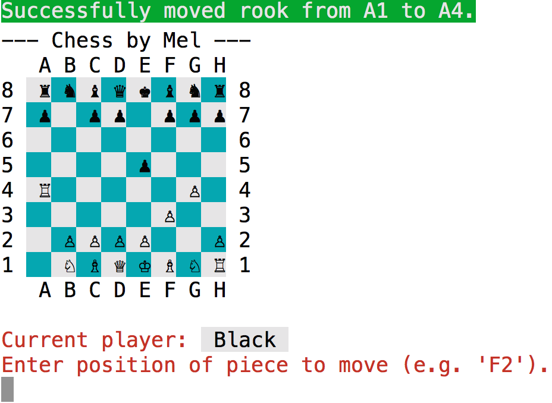

# Chess!

Here is my very own object-oriented chess game!  It's a lot of fun if I do say so myself.

### Highlights:
  - DRY code through the use of class inheritance (e.g. Queen > SlidingPiece > Piece)
  - Exception handling and helper methods to handle bad user input
  - Use of Unicode and Colorize for a jazzed up user interface.

### How To Play:
  - Clone this repository locally on your machine.
  - Open Terminal and change directory to the cloned repository (default name 'chess').
  - Run `$ bundle install` to install included gems.
  - Navigate to the `lib` folder and enter the following command in your terminal
    - `$ ruby game.rb`
  - Enlarge the Terminal view by pressing `Command (⌘)-Plus Sign (+)` on Mac.
  - Enjoy!
